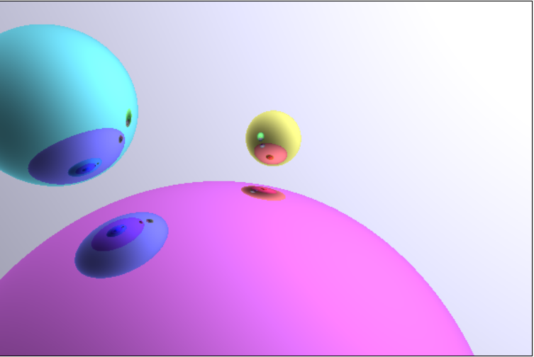

# Dynamic Ray Tracer

This is a real-time ray tracing renderer implemented in pure JavaScript, supporting movable camera perspectives, dynamic scenes, and basic reflection effects.
[View Demo](https://opming7788.github.io/Raytracing_test/raytracing_camera_move.html)

## Features

- **Real-time Ray Tracing**: Implements realistic lighting and reflection effects using ray tracing algorithms
- **Interactive Camera Control**: Supports rotating the view with mouse drag and zooming with the scroll wheel
- **Dynamic Scene**: Objects can change position over time
- **Realistic Reflections**: Light rays can bounce multiple times in the scene, creating reflection effects
- **Pure Frontend Implementation**: No backend server required, runs entirely in the browser

## Technical Implementation

### Core Technologies

- **HTML5 Canvas API**: Used for pixel rendering
- **Ray Tracing Algorithm**: Emits rays from each pixel and calculates intersections with scene objects and reflections
- **Vector Mathematics**: Handles ray directions, reflections, and intersection calculations in 3D space
- **Camera Model**: Implements a complete perspective projection camera model
- **Animation Loop**: Uses `requestAnimationFrame` for smooth rendering cycles

### Ray Tracing Process

1. For each pixel, emit a ray from the camera position
2. Detect intersections between the ray and scene objects
3. Calculate the reflected ray at the intersection point
4. Continue tracing the reflected ray for intersections with other objects
5. Repeat this process several times, accumulating color values
6. Render the final color value to the pixel

### Camera System

- **Spherical Coordinate System**: Uses horizontal angle (angleY) and vertical angle (angleX) to control camera direction
- **Orthogonal Basis**: Calculates the camera's three orthogonal vectors (viewX, viewY, viewZ)
- **Perspective Projection**: Uses field of view (FOV) and aspect ratio to calculate pixel rays

### Interactive Controls

- **Mouse Drag**: Right-click or Shift+left-click drag to rotate the view
- **Mouse Wheel**: Adjust camera distance (zoom)
- **View Constraints**: Prevents the view from flipping

## How to Use

1. Clone this repository
2. Open `raytracing_camera_move.html` in your browser
3. Use right-click drag or Shift+left-click drag to rotate the view
4. Use the mouse wheel to adjust zoom

## Performance Considerations

- Ray tracing is computationally intensive and may cause reduced frame rates on low-performance devices
- The current implementation uses basic ray tracing without acceleration structures
- The number of spheres in the scene and reflection iteration count significantly impact performance

## Potential Extensions

- Add more types of geometry (planes, triangles, cubes, etc.)
- Implement more complex materials (refraction, diffusion, subsurface scattering)
- Add area light sources and soft shadows
- Implement depth of field effects
- Use Web Workers or GPU acceleration (WebGL/WebGPU) to improve performance
